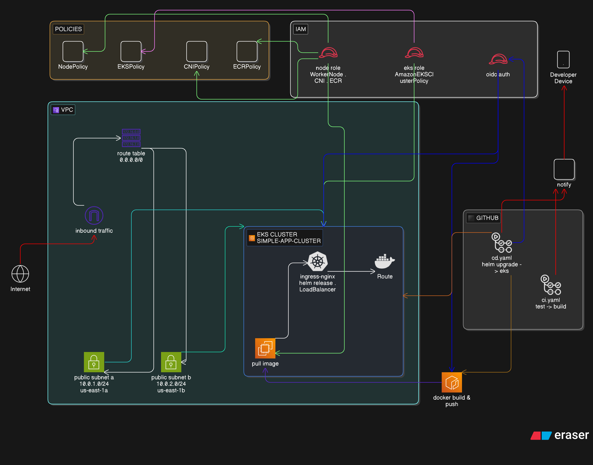

# Simple-App

## Description 
A simple python fastApi app (serves as a placeholder for real app) used to demonstrate the CI/CD pipeline 

## Flow Overview 
```bash 
GitHub Push → GitHub Actions → Build & Test → Push to ECR → Deploy to EKS → Live App
```

## Diagram 


You can check the code here
[diagram code](images/diagram-code.txt)

## Stack Breakdown 
- python **v3.14.3**
- Docker **v29.3.0** (both client and server)
- Docker-compose **v5.1.0**
- Kubernetes (kubectl **v1.35.1**, Kustomize **v5.7.1**)
- Helm **v3.19.0**
- minikube **v1.38.1** (for local dev/test)
- Act **v0.2.82** (for local ci/cd pipeline testing)
- AWS Services: VPC/ ECR/ EKS /EC2 /IAM 

## Project Tree 
```bash.
simple-app
├── .github   
│   └── workflows  # ci/cd workflow files
│       ├── cd.yaml
│       └── ci.yaml
├── app     # simple python fastApi app
│   ├── main.py
│   ├── requirements.txt
│   └── tests
│       ├── __init__.py
│       ├── main_test.py
├── docker-compose.dev.yaml  # docker compose for local dev
├── docker-compose.yaml      # docker compose for prod
├── Dockerfile
├── .gitignore
├── values.local.yaml  # ignored file in the tree unless created locally
├── README.md
├── simple-app  # Helm Chart
│   ├── charts
│   ├── Chart.yaml
│   ├── templates
│   │   ├── deployment.yaml
│   │   ├── _helpers.tpl
│   │   ├── ingress.yaml
│   │   ├── resourceQuota.yaml
│   │   └── service.yaml
│   └── values.yaml
└── terraform   # Iac with terraform
│   ├── helm.tf
│   ├── main.tf
│   ├── modules
│   │   ├── ec2
│   │   │   ├── main.tf
│   │   │   ├── output.tf
│   │   │   └── variables.tf
│   │   ├── eks
│   │   │   ├── main.tf
│   │   │   ├── outputs.tf
│   │   │   └── variables.tf
│   │   ├── gha_iam
│   │   │   ├── data.tf
│   │   │   ├── main.tf
│   │   │   ├── outputs.tf
│   │   │   └── variables.tf
│   │   ├── iam
│   │   │   ├── main.tf
│   │   │   ├── outputs.tf
│   │   │   └── variables.tf
│   │   ├── igw
│   │   │   ├── main.tf
│   │   │   ├── outputs.tf
│   │   │   └── variables.tf
│   │   └── vpc
│   │       ├── main.tf
│   │       ├── outputs.tf
│   │       └── variables.tf
│   ├── outputs.tf
│   └── variables.tf
└── values.local.yaml
```

## Installation & Local Setup 
```bash 
# Clone and move into the simple-app dir
git clone https://github.com/ignorant05/simple-app 
cd simple-app

# AWS credentials
# export the creds into your env file (eg. .zshrc or .bashrc files)
export AWS_ACCESS_KEY_ID="<your-iam-access-key-id>"
export AWS_SECRET_ACCESS_KEY="<your-iam-secret-access-key>"

# Note: the IAM user needs the following policies:
#       - `AmazonEKSClusterPolicy`
#       - `AmazonEC2ContainerRegistryFullAccess`
#       - `AmazonEKSWorkerNodePolicy`

# setup minikube cluster with custom cpu/ram
minikube start --cpus 4 --memory 4096 
eval $(minikube docker-env)

# Note: if you encounter a docker issue, it's mostly because: 
#   - docker.service isn\'t running, then just restart it
#   - docker cannot authenticate you, then just use `docker logout`, `docker login` to reauthenticate

# building docker image 
docker build -t simple-app:test . 

# loading image to minikube cluster
minikube image load simple-app:test 

# if you clone this repo 
# the image is sat to "IMAGE_PLACEHOLDER", so you need to run this in order to run test locally
# so we'll create a local file override file ignoredby git (via .gitignore)
# Note: make sure that you run the following command in the root directory
cat > values.local.yaml <<EOF
image:
  repository: simple-app
  tag: test
EOF

# add the ignored file in the ".gitignore" file
grep -rye "Values.local.yaml" .gitignore || echo "# helm, local dev \nvalues.local.yaml" >> .gitignore

# create a namespace 
kubectl get ns simple-app-ns || kubectl create ns simple-app-ns

# install the helm chart
helm install simple-app ./simple-app -n simple-app-ns -f values.local.yaml

# Watch for errors via **describe/get/logs** subcommands
kubectl get pods -n simple-app-ns
kubectl describe pod <target-pod-name> -n simple-app-ns
kubectl logs <target-pod-name> -n simple-app-ns

# if no errors found, then use your webclient or browser (because it\'s a fastApi app) to test it

# 1st method
# tunnel via minikube (straight forward)
minikube tunnel 

# get "ClusterIP" via svc resource
kubectl get svc -n simple-app-ns 

# use it to access the api, try the "/" and "/health" endpoints
# if you get messages in json format then you're good to go

# 2nd method
# port forwarding via kubectl
# i used port 8080 here but you can use any port that is not mapped to any external service on you local machine
kubectl port-forward -n simple-app-ns svc/simple-app-service 8080:80

# use "localhost:8080" to access the endpoints
# try the "/" and "/health" endpoints
# if you get messages in json format then you're good to go

# Note: for users that made changed after first install 
#       to apply changes after first install (instead of helm install)
helm upgrade simple-app ./simple-app -n simple-app-ns -f values.local.yaml
```

